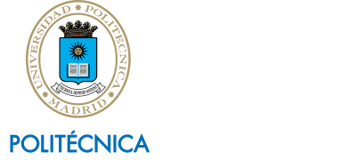

# *Sistema de Supervisión Ambiental* (SPV)
### **Proyecto Fin de Grado en [Ingeniería de Computadores](https://computadores.etsisi.upm.es/) - [Gabriel Gutiérrez Fuentes](https://github.com/gabgutf) - ETSISI UPM 2026**

|  |  |  |  |
|:--:|:--:|:--:|:--:|
| **PCB** | **Firmware** | **App** | **Thesis** |

---
